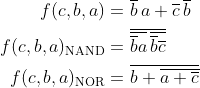
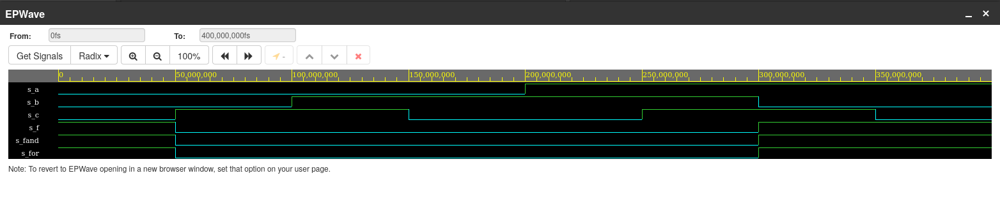

# Labs 1: Gates
## Verification of De Morgan's law
### Code
```vhdl
library ieee;               -- Standard library
use ieee.std_logic_1164.all;-- Package for data types and logic operations

entity gates is
    port(
        a_i    : in  std_logic;         -- Data input
        b_i    : in  std_logic;         -- Data input
        c_i    : in  std_logic;
        f_o    : out std_logic;         -- OR output function
        fand_o : out std_logic;         -- AND output function
        for_o  : out std_logic          -- XOR output function
    );
end entity gates;

architecture dataflow of gates is
begin
    f_o  <= ((not b_i) and a_i ) or ((not b_i) and (not c_i));
    fand_o <= ((not b_i) nand a_i) nand ((not b_i) nand (not c_i));
    for_o <= not ((not (a_i or (not c_i))) or b_i);

end architecture dataflow;
```

### Logic functions


### EDA Playground Verification

[EDA Playground link](https://www.edaplayground.com/x/8Lvx)

### Function table
| **a** | **b** |**c** | **f(c,b,a)** |
| :-: | :-: | :-: | :-: |
| 0 | 0 | 0 | 1 |
| 0 | 0 | 1 | 0 |
| 0 | 1 | 0 | 0 |
| 0 | 1 | 1 | 0 |
| 1 | 0 | 0 | 1 |
| 1 | 0 | 1 | 1 |
| 1 | 1 | 0 | 0 |
| 1 | 1 | 1 | 0 |

