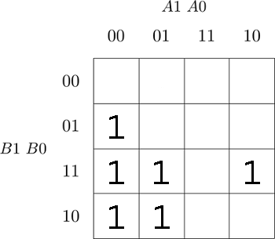
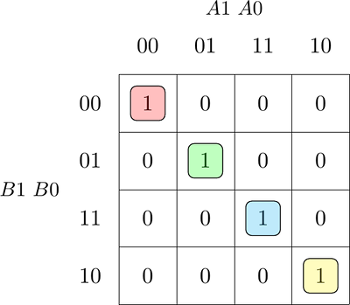
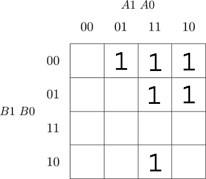

# 1. Comparator truth table
| **Dec. equivalent** | **B[1:0]** | **A[1:0]** | **B is greater than A** | **B equals A** | **B is less than A** |
| :-: | :-: | :-: | :-: | :-: | :-: |
| 0  | 0 0 | 0 0 | 0 | 1 | 0 |
| 1  | 0 0 | 0 1 | 0 | 0 | 1 |
| 2  | 0 0 | 1 0 | 0 | 0 | 1 |
| 3  | 0 0 | 1 1 | 0 | 0 | 1 |
| 4  | 0 1 | 0 0 | 1 | 0 | 0 |
| 5  | 0 1 | 0 1 | 0 | 1 | 0 |
| 6  | 0 1 | 1 0 | 0 | 0 | 1 |
| 7  | 0 1 | 1 1 | 0 | 0 | 1 |
| 8  | 1 0 | 0 0 | 1 | 0 | 0 |
| 9  | 1 0 | 0 1 | 1 | 0 | 0 |
| 10 | 1 0 | 1 0 | 0 | 1 | 0 |
| 11 | 1 0 | 1 1 | 0 | 0 | 1 |
| 12 | 1 1 | 0 0 | 1 | 0 | 0 |
| 13 | 1 1 | 0 1 | 1 | 0 | 0 |
| 14 | 1 1 | 1 0 | 1 | 0 | 0 |
| 15 | 1 1 | 1 1 | 0 | 1 | 0 |

# 2. 2 bit comparator
## B is greater than A


 


## B equals A



## B is less than A



# 3. 
## design.vhdl
``` vhdl
------------------------------------------------------------------------
--
-- Example of 2-bit binary comparator using the when/else assignment.
-- EDA Playground
--
-- Copyright (c) 2020-2021 Tomas Fryza
-- Dept. of Radio Electronics, Brno University of Technology, Czechia
-- This work is licensed under the terms of the MIT license.
--
------------------------------------------------------------------------

library ieee;
use ieee.std_logic_1164.all;

------------------------------------------------------------------------
-- Entity declaration for 2-bit binary comparator
------------------------------------------------------------------------
entity comparator_2bit is
    port(
    	a_i		: in  std_logic_vector(2 - 1 downto 0);
        b_i		: in  std_logic_vector(2 - 1 downto 0);


        -- COMPLETE ENTITY DECLARATION
		B_greater_A_o : out std_logic;
        B_equal_A_o  : out std_logic;

        B_less_A_o    : out std_logic       -- B is less than A
    );
end entity comparator_2bit;

------------------------------------------------------------------------
-- Architecture body for 2-bit binary comparator
------------------------------------------------------------------------
architecture Behavioral of comparator_2bit is
begin
    B_less_A_o		<= '1' when (b_i < a_i) else '0';
    


    -- WRITE "GREATER" AND "EQUALS" ASSIGNMENTS HERE
	B_equal_A_o		<= '1' when (b_i = a_i) else '0';
    B_greater_A_o	<= '1' when (b_i > a_i) else '0';

end architecture Behavioral;

```

## testbench.vhdl
``` vhdl
------------------------------------------------------------------------
--
-- Testbench for 2-bit binary comparator.
-- EDA Playground
--
-- Copyright (c) 2020-2021 Tomas Fryza
-- Dept. of Radio Electronics, Brno University of Technology, Czechia
-- This work is licensed under the terms of the MIT license.
--
------------------------------------------------------------------------

library ieee;
use ieee.std_logic_1164.all;

------------------------------------------------------------------------
-- Entity declaration for testbench
------------------------------------------------------------------------
entity tb_comparator_2bit is
    -- Entity of testbench is always empty
end entity tb_comparator_2bit;

------------------------------------------------------------------------
-- Architecture body for testbench
------------------------------------------------------------------------
architecture testbench of tb_comparator_2bit is

    -- Local signals
    signal s_a       : std_logic_vector(2 - 1 downto 0);
    signal s_b       : std_logic_vector(2 - 1 downto 0);
    signal s_B_greater_A : std_logic;
    signal s_B_equals_A  : std_logic;
    signal s_B_less_A    : std_logic;

begin
    -- Connecting testbench signals with comparator_2bit entity (Unit Under Test)
    uut_comparator_2bit : entity work.comparator_2bit
        port map(
            a_i           => s_a,
            b_i           => s_b,
            B_greater_A_o => s_B_greater_A,
            B_equal_A_o  => s_B_equals_A,
            B_less_A_o    => s_B_less_A
        );

    --------------------------------------------------------------------
    -- Data generation process
    --------------------------------------------------------------------
    p_stimulus : process
    begin
        -- Report a note at the begining of stimulus process
        report "Stimulus process started" severity note;


        -- First test values
       -- s_b <= "00"; s_a <= "00"; wait for 100 ns;
        -- Expected output
        --assert ((s_B_greater_A = '0') and (s_B_equals_A = '1') and (s_B_less_A = '0'))
        -- If false, then report an error
        --report "Test failed for input combination: 00, 00" severity error;
        
        
        -- WRITE OTHER TESTS HERE
        
        s_b <= "00"; s_a <= "00"; wait for 100 ns;
        assert ((s_B_greater_A = '0') and (s_B_equals_A = '1') and (s_B_less_A = '0'))
        report "Test failed for input combination: 00,00" severity warning;
        
        s_b <= "00"; s_a <= "01"; wait for 100 ns;
        assert ((s_B_greater_A = '0') and (s_B_equals_A = '0') and (s_B_less_A = '1'))
        report "Test failed for input combination: 00,01" severity warning;
        
        s_b <= "00"; s_a <= "10"; wait for 100 ns;
        assert ((s_B_greater_A = '0') and (s_B_equals_A = '0') and (s_B_less_A = '1'))
        report "Test failed for input combination: 00,10" severity warning;
        
        s_b <= "00"; s_a <= "11"; wait for 100 ns;
        assert ((s_B_greater_A = '0') and (s_B_equals_A = '0') and (s_B_less_A = '1'))
        report "Test failed for input combination: 00,11" severity warning;
        
        
        
        s_b <= "01"; s_a <= "00"; wait for 100 ns;
        assert ((s_B_greater_A = '1') and (s_B_equals_A = '0') and (s_B_less_A = '0'))
        report "Test failed for input combination: 00,00" severity warning;
        
        s_b <= "01"; s_a <= "01"; wait for 100 ns;
        assert ((s_B_greater_A = '0') and (s_B_equals_A = '1') and (s_B_less_A = '0'))
        report "Test failed for input combination: 00,01" severity warning;
        
        s_b <= "01"; s_a <= "10"; wait for 100 ns;
        assert ((s_B_greater_A = '0') and (s_B_equals_A = '0') and (s_B_less_A = '1'))
        report "Test failed for input combination: 00,10" severity warning;
        
        s_b <= "01"; s_a <= "11"; wait for 100 ns;
        assert ((s_B_greater_A = '0') and (s_B_equals_A = '0') and (s_B_less_A = '1'))
        report "Test failed for input combination: 00,11" severity warning;
        
        
        
        
        s_b <= "10"; s_a <= "00"; wait for 100 ns;
        assert ((s_B_greater_A = '1') and (s_B_equals_A = '0') and (s_B_less_A = '0'))
        report "Test failed for input combination: 00,00" severity warning;
        
        s_b <= "10"; s_a <= "01"; wait for 100 ns;
        assert ((s_B_greater_A = '1') and (s_B_equals_A = '0') and (s_B_less_A = '0'))
        report "Test failed for input combination: 00,01" severity warning;
        
        s_b <= "10"; s_a <= "10"; wait for 100 ns;
        assert ((s_B_greater_A = '0') and (s_B_equals_A = '1') and (s_B_less_A = '0'))
        report "Test failed for input combination: 00,10" severity warning;
        
        s_b <= "10"; s_a <= "11"; wait for 100 ns;
        assert ((s_B_greater_A = '0') and (s_B_equals_A = '0') and (s_B_less_A = '1'))
        report "Test failed for input combination: 00,11" severity warning;
        
        
        
        
        s_b <= "11"; s_a <= "00"; wait for 100 ns;
        assert ((s_B_greater_A = '1') and (s_B_equals_A = '0') and (s_B_less_A = '0'))
        report "Test failed for input combination: 00,00" severity warning;
        
        s_b <= "11"; s_a <= "01"; wait for 100 ns;
        assert ((s_B_greater_A = '1') and (s_B_equals_A = '0') and (s_B_less_A = '0'))
        report "Test failed for input combination: 00,01" severity warning;
        
        s_b <= "11"; s_a <= "10"; wait for 100 ns;
        assert ((s_B_greater_A = '1') and (s_B_equals_A = '0') and (s_B_less_A = '0'))
        report "Test failed for input combination: 00,10" severity warning;
        
        s_b <= "11"; s_a <= "11"; wait for 100 ns;
        assert ((s_B_greater_A = '0') and (s_B_equals_A = '0') and (s_B_less_A = '1'))
        report "Test failed for input combination: 00,11" severity warning;
        


        -- Report a note at the end of stimulus process
        report "Stimulus process finished" severity note;
        wait;
    end process p_stimulus;

end architecture testbench;

```
## Simulation output
```
analyze design.vhd
analyze testbench.vhd
elaborate tb_comparator_2bit
testbench.vhd:51:9:@0ms:(report note): Stimulus process started
testbench.vhd:133:9:@1600ns:(assertion warning): Test failed for input combination: 00,11
testbench.vhd:139:9:@1600ns:(report note): Stimulus process finished
```

##[Public playground link](https://www.edaplayground.com/x/mBrE)
