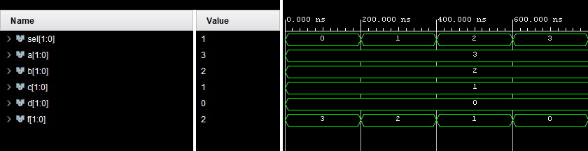

# 03 - Vivado
## 1. Nexys A7
### Push switches
| LABEL | FPGA PIN |
| ===== | ======== |
|  SW0  |    J15   |
|  SW1  |    L16   |
|  SW2  |    M13   |
|  SW3  |    R15   |
|  SW4  |    R17   |
|  SW5  |    T18   |
|  SW6  |    U18   |
|  SW7  |    R13   |
|  SW8  |    T8    |
|  SW9  |    U8    |
|  SW10 |    R16   |
|  SW11 |    T13   |
|  SW12 |    H6    |
|  SW13 |    U12   |
|  SW14 |    U11   |
|  SW15 |    V10   |

### LEDs
| LABEL | FPGA PIN |
| ===== | ======== |
|  LD0  |    H17   |
|  LD1  |    K15   |
|  LD2  |    J13   |
|  LD3  |    N14   |
|  LD4  |    R18   |
|  LD5  |    V17   |
|  LD6  |    U17   |
|  LD7  |    U16   |
|  LD8  |    V16   |
|  LD9  |    T15   |
|  LD10 |    U14   |
|  LD11 |    T16   |
|  LD12 |    V15   |
|  LD13 |    V14   |
|  LD14 |    V12   |
|  LD15 |    V11   |

Place table here
## 2. 2 bit 4 wide multiplexer
### mux_2bit_4to1.vhd
```` vhdl

library IEEE;
use IEEE.STD_LOGIC_1164.ALL;

entity mux_2bit_4to1 is
    Port ( sel_i : in std_logic_vector(1 downto 0);
           a_i   : in std_logic_vector(1 downto 0);
           b_i   : in std_logic_vector(1 downto 0);
           c_i   : in std_logic_vector(1 downto 0);
           d_i   : in std_logic_vector(1 downto 0);
           f_o   : out STD_LOGIC_vector(1 downto 0)
           );
end mux_2bit_4to1;

architecture Behavioral of mux_2bit_4to1 is

begin
    f_o <=  a_i when ( sel_i = "00") else
            b_i when ( sel_i = "01") else
            c_i when ( sel_i = "10") else
            d_i;


end Behavioral;
````

### tb_mux_2bit_4to1
```` vhdl
library IEEE;
use IEEE.STD_LOGIC_1164.ALL;

entity mux_2bit_4to1_tb is
end mux_2bit_4to1_tb;

architecture testbench of mux_2bit_4to1_tb is

signal sel : std_logic_vector(1 downto 0);
signal a,b,c,d,f : std_logic_vector(1 downto 0);
    
begin
uut_mux_2bit_4to1 : entity work.mux_2bit_4to1 port map(
    a_i => a,
    b_i => b,
    c_i => c,
    d_i => d,
    sel_i => sel,
    f_o => f);

stim : process
begin
sel <= "00"; 
a <= "11";
b <= "10";
c <= "01";
d <= "00";
wait for 200 ns;
sel <=  "01";
wait for 200 ns;
sel <= "10";
wait for 200 ns;
sel <= "11";
wait for 200 ns;

end process stim;
end architecture testbench;

````
### Simulated waveforms

## Vivado tutorial
1. Create new project. 
Set it's name to `multiplexer` and create a new vhdl source file `mux_2bit_4to1.vhd`. 
2. Write a vhdl code for 2bit 4 input multiplexer into `mux_2bit_4to1.vhd` file. 
3. Add a new simulation source file.
Set it's name to `tb_mux_2bit_4to1.vhd`. 
4. Write a vhdl code for testbench. 
5. Run simulation.
In project manager, roll down `SIMULATION` menu, click `Run Simulation` and select `Run behavioral simulation`.
