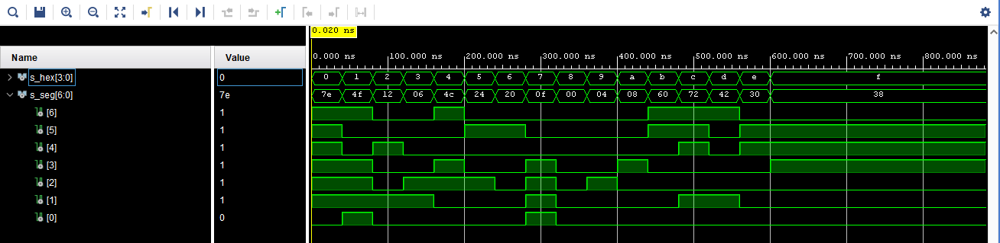
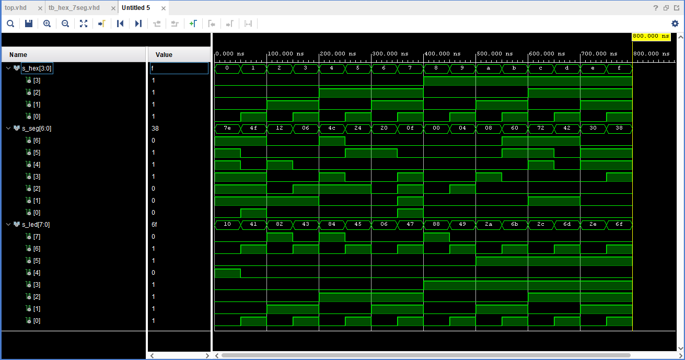

# 04 - 7 segment display decoder
## Preparation tasks
### Nexys A7 7 segment display output schematics


### Decoder truth table

|  **N** | **HEX** |  **input** | **A** | **B** | **C** | **D** | **E** | **F** | **G** |
|  :-: | :-: | :-: | :-: | :-: | :-: | :-: | :-: | :-: | :-: |
|  0 |  0  |  0000  | 0 | 0 | 0 | 0 | 0 | 0 | 1 |
|  1 |  1  |  0001  | 1 | 0 | 0 | 1 | 1 | 1 | 1 |
|  2 |  2  |  0010  | 0 | 0 | ! | 0 | 0 | 1 | 0 |
|  3 |  3  |  0011  | 0 | 0 | 0 | 0 | 1 | 1 | 0 |
|  4 |  4  |  0100  | 1 | 0 | 0 | 1 | 1 | 0 | 0 |
|  5 |  5  |  0101  | 0 | 1 | 0 | 0 | 1 | 0 | 0 |
|  6 |  6  |  0110  | 0 | 1 | 0 | 0 | 0 | 0 | 0 |
|  7 |  7  |  0111  | 0 | 0 | 0 | 1 | 1 | 1 | 1 |
|  8 |  8  |  1000  | 0 | 0 | 0 | 0 | 0 | 0 | 0 |
|  9 |  9  |  1001  | 0 | 0 | 0 | 0 | 1 | 0 | 0 |
| 10 |  A  |  1010  | 0 | 0 | 0 | 1 | 0 | 0 | 0 |
| 11 |  B  |  1011  | 0 | 1 | 1 | 0 | 0 | 0 | 0 |
| 12 |  C  |  1100  | 1 | 1 | 1 | 0 | 0 | 1 | 0 |
| 13 |  D  |  1101  | 1 | 0 | 0 | 0 | 0 | 1 | 0 |
| 14 |  E  |  1110  | 0 | 1 | 1 | 0 | 0 | 0 | 0 |
| 15 |  F  |  1111  | 0 | 1 | 1 | 1 | 0 | 0 | 0 |

## Seven segment display decoder
### hex_7seg.vhd
```` vhdl

library IEEE;
use IEEE.STD_LOGIC_1164.ALL;

entity hex_7seg is
  Port (
    hex_i : in  std_logic_vector(3 downto 0);
    seg_o : out std_logic_vector(6 downto 0)
  );
end hex_7seg;

architecture Behavioral of hex_7seg is

begin
    p_hex_7seg : process(hex_i)
    begin
        case hex_i is
            when "0000" => -- 0
                seg_o <= "1111110";
            when "0001" => -- 1
                seg_o <= "1001111";
            when "0010" => -- 2
                seg_o <= "0010010";
            when "0011" => -- 3
                seg_o <= "0000110";
            when "0100" => -- 4
                seg_o <= "1001100";
            when "0101" => -- 5
                seg_o <= "0100100";
            when "0110" => -- 6
                seg_o <= "0100000";
            when "0111" => -- 7
                seg_o <= "0001111";
            when "1000" => -- 8
                seg_o <= "0000000";
            when "1001" => -- 9
                seg_o <= "0000100";
            when "1010" => -- A
                seg_o <= "0001000";
            when "1011" => -- b
                seg_o <= "1100000";
            when "1100" => -- c
                seg_o <= "1110010";
            when "1101" => -- d
                seg_o <= "1000010";
            when "1110" => -- E
                seg_o <= "0110000";
            when "1111" => -- F
                seg_o <= "0111000";
            when others =>
                seg_o <= "1111111";
        end case;
    end process p_hex_7seg;

end Behavioral;

````
### hex_7seg_tb.vhd
```` vhdl

library IEEE;
use IEEE.STD_LOGIC_1164.ALL;

entity tb_hex_7seg is
--  Port ( );
end tb_hex_7seg;

architecture testbench of tb_hex_7seg is
    -- signals
    signal s_hex    : std_logic_vector(3 downto 0);
    signal s_seg    : std_logic_vector(6 downto 0);
begin
    uut_hex_7seg : entity work.hex_7seg port map(
        hex_i => s_hex,
        seg_o => s_seg
        );
    p_stim : process
    begin
        s_hex <= "0000"; wait for 40 ns;
        s_hex <= "0001"; wait for 40 ns;
        s_hex <= "0010"; wait for 40 ns;
        s_hex <= "0011"; wait for 40 ns;
        
        s_hex <= "0100"; wait for 40 ns;
        s_hex <= "0101"; wait for 40 ns;
        s_hex <= "0110"; wait for 40 ns;
        s_hex <= "0111"; wait for 40 ns;
        
        s_hex <= "1000"; wait for 40 ns;
        s_hex <= "1001"; wait for 40 ns;
        s_hex <= "1010"; wait for 40 ns;
        s_hex <= "1011"; wait for 40 ns;
        
        s_hex <= "1100"; wait for 40 ns;
        s_hex <= "1101"; wait for 40 ns;
        s_hex <= "1110"; wait for 40 ns;
        s_hex <= "1111"; wait for 40 ns;
        wait;
    end process p_stim;
end architecture testbench;
````
### Simulated waveforms


## Led indicators
### Truth table

|  **N** | **HEX** |  **LEDs**  |
|  :-:  |  :-: | :-: |
|  0 |  0  |  0000  |
|  1 |  1  |  0001  |
|  2 |  2  |  0010  |
|  3 |  3  |  0011  |
|  4 |  4  |  0100  |
|  5 |  5  |  0101  |
|  6 |  6  |  0110  |
|  7 |  7  |  0111  |
|  8 |  8  |  1000  |
|  9 |  9  |  1001  |
| 10 |  A  |  1010  |
| 11 |  B  |  1011  |
| 12 |  C  |  1100  |
| 13 |  D  |  1101  |
| 14 |  E  |  1110  |
| 15 |  F  |  1111  |

### Led indicators code (top.vhd)
```` vhdl
library IEEE;
use IEEE.STD_LOGIC_1164.ALL;

entity top is
    Port (
        
        SW  : in  std_logic_vector(3 downto 0);
        SSEG_AN : out std_logic_vector(7 downto 0);
        LED     : out std_logic_vector(7 downto 0);
        CA  : out std_logic;
        CB  : out std_logic;
        CC  : out std_logic;
        CD  : out std_logic;
        CE  : out std_logic;
        CF  : out std_logic;
        CG  : out std_logic        
    );
end top;

architecture Behavioral of top is

begin
    hex2seg : entity work.hex_7seg
        port map(
            hex_i => SW,
            seg_o(6) => CA,
            seg_o(5) => CB,
            seg_o(4) => CC,
            seg_o(3) => CD,
            seg_o(2) => CE,
            seg_o(1) => CF,
            seg_o(0) => CG
        );
    SSEG_AN <= b"1111_0111";
    
    LED(3 downto 0) <= SW;
    
    LED(4) <= '1' when (SW = "0000") else
              '0';
    LED(5) <= '1' when (SW > "1001") else
              '0';
    LED(6) <= '1' when (SW(0) = '1') else
              '0';
    LED(7) <= '1' when (SW = "0010") or
                       (SW = "0100") or
                       (SW = "1000") else
              '0';
end Behavioral;
````

### All inputs and outputs 

