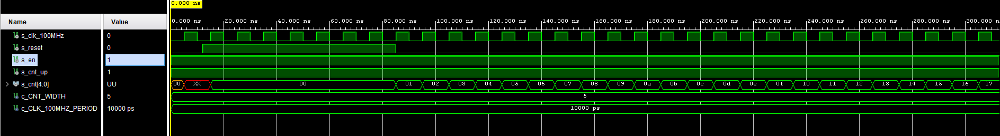
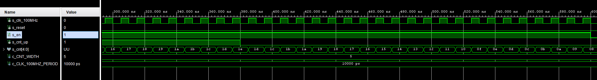
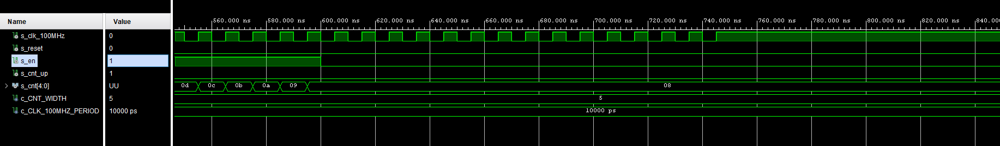

# 05 - Counter
## Preparation tasks
### Nexys A7 input/output partial schematics


### Table with calculated values
| **Time interval** | **Number of clk periods** | **Number of clk periods in hex** | **Number of clk periods in binary** |
| :-: | :-: | :-: | :-: |
| 2 ms   | 200 000 | `x"3_0d40"` | `b"0011_0000_1101_0100_0000"` |
| 4 ms   | 400 000 | `x"6_1A80"` | `b"0110_0001_1010_1000_0000"` |
| 10 ms  | 1 000 000 | `x"F_4240"` | `b"1111_0100_0010_0100_0000"` |
| 250 ms | 25 000 000 | `x"17D_7840"` | `b"0001_0111_1101_0111_1000_0100_0000"` |
| 500 ms | 50 000 000 | `x"2FA_F080"` | `b"0010_1111_1010_1111_0000_1000_0000"` |
| 1 sec  | 100 000 000 | `x"5F5_E100"` | `b"0101_1111_0101_1110_0001_0000_0000"` |

## Bidirectional counter
### cnt_up_down.vhd
```` vhdl
library ieee;
use ieee.std_logic_1164.all;
use ieee.numeric_std.all;

------------------------------------------------------------------------
-- Entity declaration for n-bit counter
------------------------------------------------------------------------
entity cnt_up_down is
    generic(
        g_CNT_WIDTH : natural := 4      -- Number of bits for counter
    );
    port(
        clk      : in  std_logic;       -- Main clock
        reset    : in  std_logic;       -- Synchronous reset
        en_i     : in  std_logic;       -- Enable input
        cnt_up_i : in  std_logic;       -- Direction of the counter
        cnt_o    : out std_logic_vector(g_CNT_WIDTH - 1 downto 0)
    );
end entity cnt_up_down;

------------------------------------------------------------------------
-- Architecture body for n-bit counter
------------------------------------------------------------------------
architecture behavioral of cnt_up_down is

    -- Local counter
    signal s_cnt_local : unsigned(g_CNT_WIDTH - 1 downto 0);

begin
    --------------------------------------------------------------------
    -- p_cnt_up_down:
    -- Clocked process with synchronous reset which implements n-bit 
    -- up/down counter.
    --------------------------------------------------------------------
    p_cnt_up_down : process(clk)
    begin
        if rising_edge(clk) then
        
            if (reset = '1') then               -- Synchronous reset
                s_cnt_local <= (others => '0'); -- Clear all bits

            elsif (en_i = '1') then       -- Test if counter is enabled


                -- TEST COUNTER DIRECTION HERE
                if (cnt_up_i = '1') then
                    if (s_cnt_local >= 2**g_CNT_WIDTH - 1) then
                        s_cnt_local <= (others => '0');
                    else
                        s_cnt_local <= s_cnt_local + 1;
                    end if;
                else
                    if (s_cnt_local = 0) then
                        s_cnt_local <= (others => '1');
                    else
                        s_cnt_local <= s_cnt_local - 1;
                    end if;
                end if;
            end if;
        end if;
    end process p_cnt_up_down;

    -- Output must be retyped from "unsigned" to "std_logic_vector"
    cnt_o <= std_logic_vector(s_cnt_local);

end architecture behavioral;

````

### tb_cnt_up_down.vhd
```` vhdl
library ieee;
use ieee.std_logic_1164.all;

------------------------------------------------------------------------
-- Entity declaration for testbench
------------------------------------------------------------------------
entity tb_cnt_up_down is
    -- Entity of testbench is always empty
end entity tb_cnt_up_down; 

------------------------------------------------------------------------
-- Architecture body for testbench
------------------------------------------------------------------------
architecture testbench of tb_cnt_up_down is

    -- Number of bits for testbench counter
    constant c_CNT_WIDTH         : natural := 5;
    constant c_CLK_100MHZ_PERIOD : time    := 10 ns;

    --Local signals
    signal s_clk_100MHz : std_logic;
    signal s_reset      : std_logic;
    signal s_en         : std_logic;
    signal s_cnt_up     : std_logic;
    signal s_cnt        : std_logic_vector(c_CNT_WIDTH - 1 downto 0);

begin
    -- Connecting testbench signals with cnt_up_down entity
    -- (Unit Under Test)
    uut_cnt : entity work.cnt_up_down
        generic map(
            g_CNT_WIDTH  => c_CNT_WIDTH
        )
        port map(
            clk      => s_clk_100MHz,
            reset    => s_reset,
            en_i     => s_en,
            cnt_up_i => s_cnt_up,
            cnt_o    => s_cnt
        );

    --------------------------------------------------------------------
    -- Clock generation process
    --------------------------------------------------------------------
    p_clk_gen : process
    begin
        while now < 750 ns loop         -- 75 periods of 100MHz clock
            s_clk_100MHz <= '0';
            wait for c_CLK_100MHZ_PERIOD / 2;
            s_clk_100MHz <= '1';
            wait for c_CLK_100MHZ_PERIOD / 2;
        end loop;
        wait;
    end process p_clk_gen;

    --------------------------------------------------------------------
    -- Reset generation process
    --------------------------------------------------------------------
    p_reset_gen : process
    begin
        s_reset <= '0';
        wait for 12 ns;
        
        -- Reset activated
        s_reset <= '1';
        wait for 73 ns;

        s_reset <= '0';
        wait;
    end process p_reset_gen;

    --------------------------------------------------------------------
    -- Data generation process
    --------------------------------------------------------------------
    p_stimulus : process
    begin
        report "Stimulus process started" severity note;

        -- Enable counting
        s_en     <= '1';
        
        -- Change counter direction
        s_cnt_up <= '1';
        wait for 380 ns;
        s_cnt_up <= '0';
        wait for 220 ns;

        -- Disable counting
        s_en     <= '0';

        report "Stimulus process finished" severity note;
        wait;
    end process p_stimulus;

end architecture testbench;
````

### Simulated waveforms
#### Reset signal effect

#### Count up/down

#### Count stop



## Top level
### top.vhd
```` vhdl
----------------------------------------------------------------------------------
-- Company: 
-- Engineer: 
-- 
-- Create Date: 16.03.2021 22:19:41
-- Design Name: 
-- Module Name: top - Behavioral
-- Project Name: 
-- Target Devices: 
-- Tool Versions: 
-- Description: 
-- 
-- Dependencies: 
-- 
-- Revision:
-- Revision 0.01 - File Created
-- Additional Comments:
-- 
----------------------------------------------------------------------------------


library IEEE;
use IEEE.STD_LOGIC_1164.ALL;

-- Uncomment the following library declaration if using
-- arithmetic functions with Signed or Unsigned values
--use IEEE.NUMERIC_STD.ALL;

-- Uncomment the following library declaration if instantiating
-- any Xilinx leaf cells in this code.
--library UNISIM;
--use UNISIM.VComponents.all;

entity top is
    Port (
        CLK100MHZ   : in std_logic;
        BTNC        : in std_logic;
        SW          : in std_logic_vector(1 - 1 downto 0);
        LED         : out std_logic_vector(4 - 1 downto 0);
        CA          : out std_logic;
        CB          : out std_logic;
        CC          : out std_logic;
        CD          : out std_logic;
        CE          : out std_logic;
        CF          : out std_logic;
        CG          : out std_logic;
        AN          : out std_logic_vector(8 - 1 downto 0)
     );
end top;

------------------------------------------------------------------------
-- Architecture body for top level
------------------------------------------------------------------------
architecture Behavioral of top is

    -- Internal clock enable
    signal s_en  : std_logic;
    -- Internal counter
    signal s_cnt : std_logic_vector(4 - 1 downto 0);

begin

    --------------------------------------------------------------------
    -- Instance (copy) of clock_enable entity
    clk_en0 : entity work.clock_enable
        generic map(
            g_MAX => 25000000
        )
        port map(
            ce_o => s_en,
            clk => CLK100MHZ,
            reset => BTNC
        );

    --------------------------------------------------------------------
    -- Instance (copy) of cnt_up_down entity
    bin_cnt0 : entity work.cnt_up_down
        generic map(
            g_CNT_WIDTH => 4
        )
        port map(
            clk => CLK100MHZ,
            reset => BTNC,
            en_i => s_en,
            cnt_up_i => SW(0),
            cnt_o => s_cnt
        );

    -- Display input value on LEDs
    LED(3 downto 0) <= s_cnt;

    --------------------------------------------------------------------
    -- Instance (copy) of hex_7seg entity
    hex2seg : entity work.hex_7seg
        port map(
            hex_i    => s_cnt,
            seg_o(6) => CA,
            seg_o(5) => CB,
            seg_o(4) => CC,
            seg_o(3) => CD,
            seg_o(2) => CE,
            seg_o(1) => CF,
            seg_o(0) => CG
        );

    -- Connect one common anode to 3.3V
    AN <= b"1111_1110";

end architecture Behavioral;
````

### Image of top layer 

