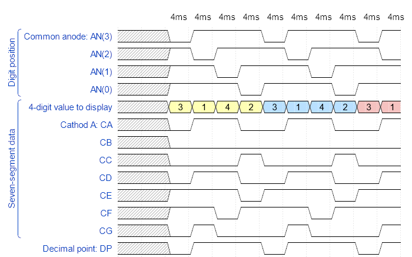
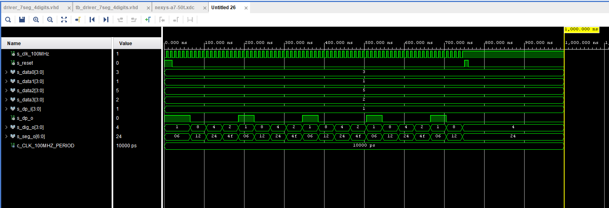

# 06 - Display driver
## Preparation tasks
### Timing diagram for value 3.142



## Display driver
### Process p_mux 
````vhdl
p_mux : process(s_cnt, data0_i, data1_i, data2_i, data3_i, dp_i)
begin
    case s_cnt is
        when "11" =>
            s_hex <= data3_i;
            dp_o  <= dp_i(3);
            dig_o <= "1000";


        when "10" =>
            -- WRITE YOUR CODE HERE
            s_hex <= data2_i;
            dp_o <= dp_i(2);
            dig_o <= "0100";

        when "01" =>
            -- WRITE YOUR CODE HERE
            s_hex <= data1_i;
            dp_o <= dp_i(1);
            dig_o <= "0010";

        when others =>
            -- WRITE YOUR CODE HERE
            s_hex <= data0_i;
            dp_o <= dp_i(0);
            dig_o <= "0001";

    end case;
end process p_mux;
````

### testbench tb_driver_7seg_4digits
````vhdl
library ieee;
use ieee.std_logic_1164.all;

------------------------------------------------------------------------
-- Entity declaration for testbench
------------------------------------------------------------------------
entity tb_driver_7seg_4digits is
    -- Entity of testbench is always empty
end entity tb_driver_7seg_4digits;

------------------------------------------------------------------------
-- Architecture body for testbench
------------------------------------------------------------------------
architecture testbench of tb_driver_7seg_4digits is

    -- Local constants
    constant c_CLK_100MHZ_PERIOD : time    := 10 ns;

    --Local signals
    signal s_clk_100MHz : std_logic;
    
    signal s_reset  : std_logic;
    signal s_data0  : std_logic_vector ( 4 - 1 downto 0 );
    signal s_data1  : std_logic_vector ( 4 - 1 downto 0 );
    signal s_data2  : std_logic_vector ( 4 - 1 downto 0 );
    signal s_data3  : std_logic_vector ( 4 - 1 downto 0 );
    signal s_dp_i   : std_logic_vector ( 4 - 1 downto 0 );
    signal s_dp_o   : std_logic;
    signal s_dig_o  : std_logic_vector( 4 - 1 downto 0 );
    signal s_seg_o  : std_logic_vector( 7 - 1 downto 0 );

begin
    -- Connecting testbench signals with driver_7seg_4digits entity
    -- (Unit Under Test)
    --- WRITE YOUR CODE HERE
    uut_driver_7seg_4digits : entity work.driver_7seg_4digits
        port map(
            clk => s_clk_100MHz,
            reset => s_reset,
            data0_i => s_data0,
            data1_i => s_data1,
            data2_i => s_data2,
            data3_i => s_data3,
            dp_i => s_dp_i,
            dp_o => s_dp_o,
            seg_o => s_seg_o,
            dig_o => s_dig_o
        );

    --------------------------------------------------------------------
    -- Clock generation process
    --------------------------------------------------------------------
    p_clk_gen : process
    begin
        -- Perform all values reset to zero all values.
        -- Otherwise the simulation doesn't work as it should
        s_clk_100MHz <= '0';
        s_reset <= '1';
        s_data0 <= "0011";
        s_data1 <= "0001";
        s_data2 <= "0101";
        s_data3 <= "0010";
        s_dp_i <= "0001";
        wait for c_CLK_100MHZ_PERIOD / 2;
        s_clk_100MHz <= '1';
        wait for c_CLK_100MHZ_PERIOD / 2;
        s_clk_100MHz <= '0';
         wait for c_CLK_100MHZ_PERIOD / 2;
        s_clk_100MHz <= '1';
        wait for c_CLK_100MHZ_PERIOD / 2;
        s_clk_100MHz <= '0';
        s_reset <= '0';
        -- Reset done
        -- Perform all values reset to zero all values.
        -- Otherwise the simulation doesn't work as it should
        
        
        while now < 750 ns loop         -- 75 periods of 100MHz clock
            s_clk_100MHz <= '0';
            wait for c_CLK_100MHZ_PERIOD / 2;
            s_clk_100MHz <= '1';
            wait for c_CLK_100MHZ_PERIOD / 2;
        end loop;
        
        -- Reset generation process
        s_reset <= '1';
        wait for c_CLK_100MHZ_PERIOD;
        s_reset <= '0';
        wait for c_CLK_100MHZ_PERIOD;
        
        -- Data generation process
        
        wait;
    end process p_clk_gen;
    
    --------------------------------------------------------------------
    -- Reset generation process
    --------------------------------------------------------------------
    --- WRITE YOUR CODE HERE

    --------------------------------------------------------------------
    -- Data generation process
    --------------------------------------------------------------------
    --- WRITE YOUR CODE HERE

end architecture testbench;
````
### Simulated time waveforms


### top vhdl file top.vhd
````vhdl
library IEEE;
use IEEE.STD_LOGIC_1164.ALL;

entity top is
    Port (
        CLK100MHZ   : in std_logic;
        BTNC        : in std_logic;
        SW          : in std_logic_vector( 16 - 1 downto 0 );
        CA          : out std_logic;
        CB          : out std_logic;
        CC          : out std_logic;
        CD          : out std_logic;
        CE          : out std_logic;
        CF          : out std_logic;
        CG          : out std_logic;
        DP          : out std_logic;
        AN          : out std_logic_vector( 8 - 1 downto 0 )
     );
end top;

------------------------------------------------------------------------
-- Architecture body for top level
------------------------------------------------------------------------
architecture Behavioral of top is
    -- No internal signals
begin

    --------------------------------------------------------------------
    -- Instance (copy) of driver_7seg_4digits entity
    driver_seg_4 : entity work.driver_7seg_4digits
        port map(
            clk        => CLK100MHZ,
            reset      => BTNC,
            data0_i(3) => SW(3),
            data0_i(2) => SW(2),
            data0_i(1) => SW(1),
            data0_i(0) => SW(0),
            data1_i(3) => SW(7),
            data1_i(2) => SW(6),
            data1_i(1) => SW(5),
            data1_i(0) => SW(4),
            data2_i(3) => SW(11),
            data2_i(2) => SW(10),
            data2_i(1) => SW(9),
            data2_i(0) => SW(8),
            data3_i(3) => SW(15),
            data3_i(2) => SW(14),
            data3_i(1) => SW(13),
            data3_i(0) => SW(12),
            dp_i => "0111",
            
            dig_o => AN(3 downto 0),
            dp_o =>  DP,
            -- CA is on the MSB because seg_o
            -- is defined as little endian logic vector
            seg_o(0) =>  CG,
            seg_o(1) =>  CF,
            seg_o(2) =>  CE,
            seg_o(3) =>  CD,
            seg_o(4) =>  CC,
            seg_o(5) =>  CB,
            seg_o(6) =>  CA
        );

    -- Disconnect the top four digits of the 7-segment display
    AN(7 downto 4) <= b"1111";

end architecture Behavioral;

````
### Eight-digit driver


