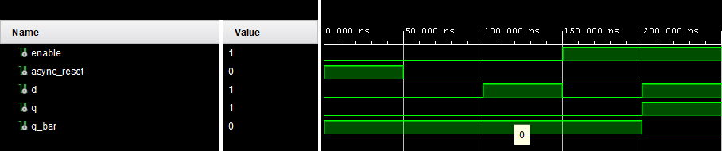
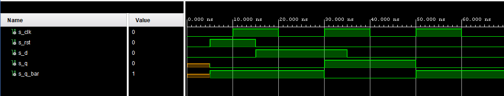
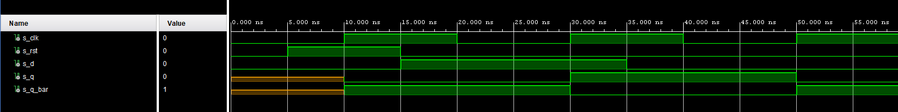
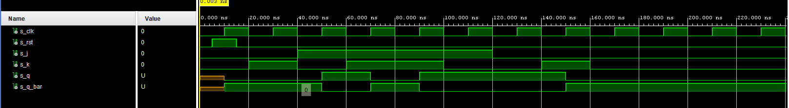
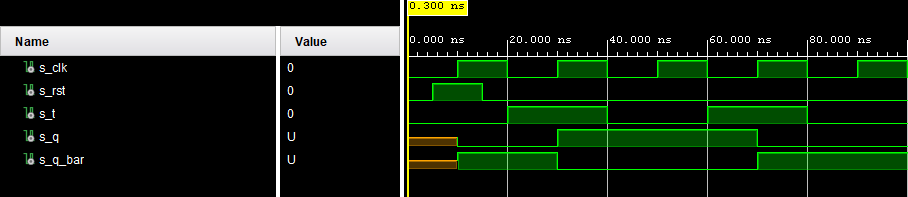
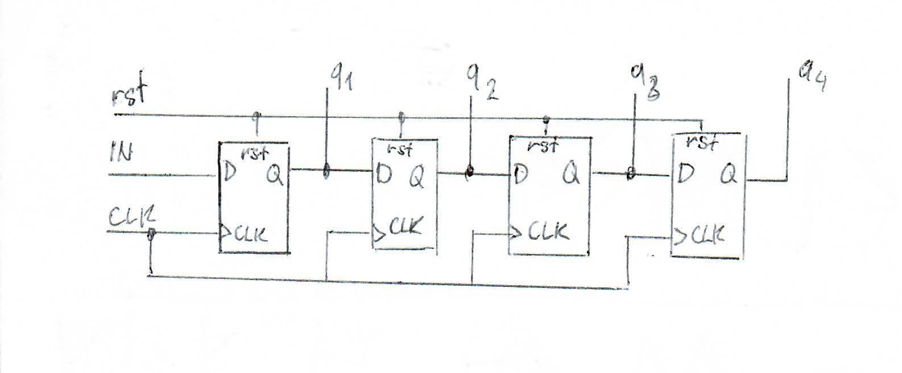

# Lab 7: Latches and Flip-flops
## Preparation tasks
### Characteristic equations and completed tables for D, JK, T flip-flops
#### D Flip flop
| **clk** | **d** | **q(n)** | **q(n+1)** | **Comments** |
| :-: | :-: | :-: | :-: | :-- |
| &uarr; | 0 | 0 | 0 |  |
| &uarr; | 0 | 1 | 0 |  |
| &uarr; | 1 | 0 | 1 |  |
| &uarr; | 1 | 1 | 1 |  |

#### JK Flip flop

| **clk** | **j** | **k** | **q(n)** | **q(n+1)** | **Comments** |
| :-: | :-: | :-: | :-: | :-: | :-- |
| &uarr; | 0 | 0 | 0 | 0 | No change |
| &uarr; | 0 | 0 | 1 | 1 | No change |
| &uarr; | 0 | 1 | 0 | 0 | Reset |
| &uarr; | 0 | 1 | 1 | 0 | Reset  |
| &uarr; | 1 | 0 | 0 | 1 | Set |
| &uarr; | 1 | 0 | 1 | 1 | Set |
| &uarr; | 1 | 1 | 0 | 1 | Inverted output |
| &uarr; | 1 | 1 | 1 | 0 | Inverted output |

#### T Flip flop
| **clk** | **t** | **q(n)** | **q(n+1)** | **Comments** |
| :-: | :-: | :-: | :-: | :-- |
| &uarr; | 0 | 0 | 0 | Keep q |
| &uarr; | 0 | 1 | 1 | Keep q |
| &uarr; | 1 | 0 | 1 | Toggle q |
| &uarr; | 1 | 1 | 0 | Toggle q |

## D latch
### VHDL code for `p_d_latch`
````vhdl
p_d_latch : process(d, arst, en)
begin
    if (arst = '1') then
        q <= '0';
        q_bar <= '1';
    elsif (en = '1') then
        q <= d;
        q_bar <= not d;
    end if;
end process;
````
### Stimulus process from tb_d_latch.vhd
```` vhdl
uut_p_d_latch : entity work.d_latch
    port map(
        en => enable,
        arst => async_reset,
        d => d,
        q => q,
        q_bar => q_bar
    );
p_clk_gen : process
begin
    d <= '0';
    enable <= '0';
    async_reset <= '1';
    wait for 50 ns;
    async_reset <= '0';
    wait for 50 ns;
    d <= '1';
    wait for 50 ns;
    enable <= '1';
    d <= '0';    
    wait for 50 ns;
    d <= '1';
    wait;
end process;
````
### Simulated waveform for d latch


## Flip-flops
### VHDL code for p_d_ff_arst.vhd
````vhdl
p_d_ff_arst : process(clk,arst,d)
begin
    if (arst = '1') then
        q <= '0';
        q_bar <= '1';
    end if;
    if (rising_edge(clk)) then
        if ( d = '0' ) then
            q <= '0';
            q_bar <= '1';
        else
            q <= '1';
            q_bar <= '0'; 
        end if;
    end if;
end process;
````

### VHDL code for p_d_ff_rst.vhd
````vhdl
p_d_ff_rst : process(clk,rst,d)
begin
    if (rising_edge(clk)) then
        if ( d = '0' ) then
            q <= '0';
            q_bar <= '1';
        else
            q <= '1';
            q_bar <= '0'; 
        end if;
        if (rst = '1') then
            q <= '0';
            q_bar <= '1';
        end if;
    end if;
end process;
````

### VHDL code for p_jk_ff_rst.vhd
````vhdl
p_jk_ff_rst : process(clk, rst, j, k, s_q)
begin
    if (rising_edge(clk)) then
        if (rst = '1') then
            s_q <= '0';
        end if;
        
        if ( j = '0' ) then
            if ( k = '1' ) then -- reset
                s_q <= '0';
            end if; -- if j and k = 0, there is no change
        else -- j = 1
            if ( k = '0' ) then -- set
                s_q <= '1';
            else    -- invert
                s_q <= not s_q;
            end if;
        end if;
        
        if (rst = '1') then
            s_q <= '0';
        end if;
        
        
    end if;
end process;
q <= s_q;
q_bar <= not s_q;
````

### VHDL code for p_t_ff_rst .vhd
````vhdl
 p_t_ff_rst : process(clk, rst, t, s_q)
begin
    if (rising_edge(clk)) then
        
        if (rst = '1') then -- synchronous reset, avoids X value on start
            s_q <= '0';
        else
            if ( t = '1' ) then
                s_q <= not s_q;
            end if;
        end if;
    end if;
end process;
q <= s_q;
q_bar <= not s_q;
````

### VHDL clock process from testbench files
````vhdl
clock : process
begin
    while now < 400ns 
        loop
            s_clk <= '0';
            wait for 10ns;
            s_clk <= '1';
            wait for 10ns;
        end loop;
    wait;
end process;
````

### VHDL reset process from testbench files
````vhdl
reset : process
begin
    s_rst <= '0';
    wait for 5 ns;
    s_rst <= '1';
    wait for 10 ns;
    s_rst <= '0';
    wait;
end process;
````

### VHDL stimulus process from testbench file `tb_d_ff_arst.vhd`
````vhdl
stimulus : process
begin
    s_d <= '0';
    wait for 15 ns;
    s_d <= '1';
    wait for 10 ns;
    s_d <= '1';
    wait for 10 ns;
    s_d <= '0';
    wait for 10 ns;
    wait;
end process;
````

### VHDL stimulus process from testbench file `tb_d_ff_rst.vhd`
````vhdl
stimulus : process
begin
    s_d <= '0';
    wait for 15 ns;
    s_d <= '1';
    wait for 10 ns;
    s_d <= '1';
    wait for 10 ns;
    s_d <= '0';
    wait for 10 ns;
    wait;
end process;
````

### VHDL stimulus process from testbench file `tb_jk_ff_rst.vhd`
````vhdl
stimulus : process
    begin
        s_j <= '0';
        s_k <= '0';
        wait for 20 ns;
        s_j <= '0';
        s_k <= '1';
        wait for 20 ns;
        s_j <= '1';
        s_k <= '0';
        wait for 20 ns;
        s_j <= '1';
        s_k <= '1';
        wait for 20 ns;
        s_j <= '1';
        s_k <= '1';
        wait for 20 ns;
        s_j <= '1';
        s_k <= '0';
        wait for 20 ns;
        s_j <= '0';
        s_k <= '0';
        wait for 20 ns;
        s_j <= '0';
        s_k <= '1';
        wait for 20 ns;
        s_j <= '0';
        s_k <= '0';
        wait;
    end process;
````

### VHDL stimulus process from testbench file `tb_t_ff_rst.vhd`
````vhdl
stimulus : process
begin
    s_t <= '0';
    wait for 20 ns;
    s_t <= '1';
    wait for 20 ns;
    s_t <= '0';
    wait for 20 ns;
    s_t <= '1';
    wait for 20 ns;
    s_t <= '0';
    wait;
end process;
````

### Screenshots of simulated waveforms
#### D flip flop with asynchronized reset


#### D flip flop with synchronized reset


#### JK flip flop with synchronized reset


#### T flip flop with synchronized reset


## Shift register schematics
