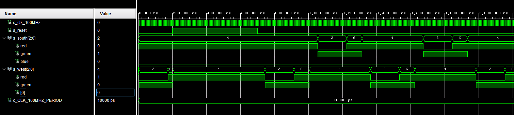
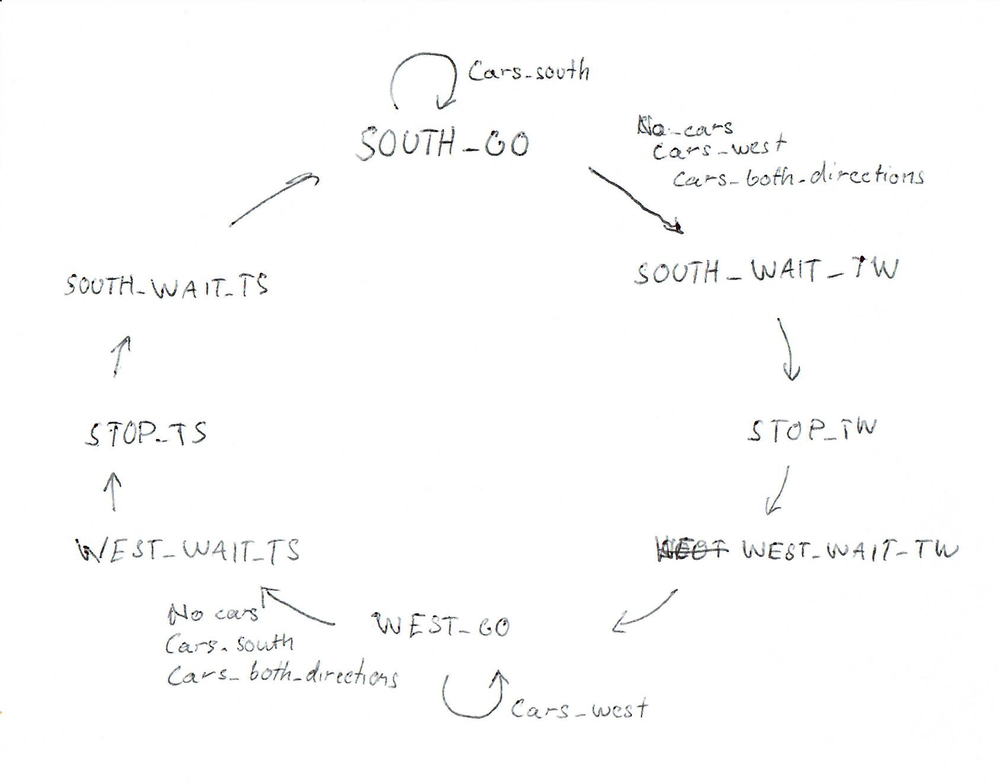

# Lab 8: Traffic light controller
## Preparation tasks
### State table
| **Input P** | `0` | `0` | `1` | `1` | `0` | `1` | `0` | `1` | `1` | `1` | `1` | `0` | `0` | `1` | `1` | `1` |
| :-- | :-: | :-: | :-: | :-: | :-: | :-: | :-: | :-: | :-: | :-: | :-: | :-: | :-: | :-: | :-: | :-: |
| **Clock** | &uarr; | &uarr; | &uarr; | &uarr; | &uarr; | &uarr; | &uarr; | &uarr; | &uarr; | &uarr; | &uarr; | &uarr; | &uarr; | &uarr; | &uarr; | &uarr; |
| **State** | A | A | A | B | C | C | D | A | B | C | D | B | B |  B | C | D |
| **Output R** | `0` | `0` | `0` | `0` | `0` | `0` | `1` | `0` | `0` | `0` | `1` | `0` | `0` | `0` | `0` | `1` |

### Nexys A7 board leds


| **RGB LED** | **Artix-7 pin names** | **Red** | **Yellow** | **Green** |
| :-: | :-: | :-: | :-: | :-: |
| LD16 | N15, M16, R12 | `1,0,0` | `1,1,0` | `0,1,0` |
| LD17 | N16, R11, G14 | `1,0,0` | `1,1,0` | `0,1,0` |

## Traffic lights controller
### Process `p_traffic_fsm` code
```` vhdl
p_traffic_fsm : process(clk)
    begin
        if rising_edge(clk) then
            if (reset = '1') then       -- Synchronous reset
                s_state <= STOP1 ;      -- Set initial state
                s_cnt   <= c_ZERO;      -- Clear all bits

            elsif (s_en = '1') then
                -- Every 250 ms, CASE checks the value of the s_state 
                -- variable and changes to the next state according 
                -- to the delay value.
                case s_state is

                    -- If the current state is STOP1, then wait 1 sec
                    -- and move to the next GO_WAIT state.
                    when STOP1 =>
                        -- Count up to c_DELAY_1SEC
                        if (s_cnt < c_DELAY_1SEC) then
                            s_cnt <= s_cnt + 1;
                        else
                            -- Move to the next state
                            s_state <= WEST_GO;
                            -- Reset local counter value
                            s_cnt   <= c_ZERO;
                        end if;

                    when WEST_GO =>
                        --  red, green, 4s
                        if (s_cnt < 4 * c_DELAY_1SEC ) then
                            s_cnt <= s_cnt + 1;
                        else
                            s_state <= WEST_WAIT;
                            s_cnt <= c_ZERO;
                        end if;

                    when WEST_WAIT =>
                        -- red, yellow, 2s
                        if (s_cnt < 2 * c_DELAY_1SEC ) then
                            s_cnt <= s_cnt + 1;
                        else
                            s_state <= STOP2;
                            s_cnt <= c_ZERO;
                        end if;
                        
                    when STOP2 =>
                        -- red, red, 1s
                        if (s_cnt < c_DELAY_1SEC ) then
                            s_cnt <= s_cnt + 1;
                        else
                            s_state <= SOUTH_GO;
                            s_cnt <= c_ZERO;
                        end if;
                        
                    when SOUTH_GO =>
                        -- green, red, 4s
                        if (s_cnt < 4 * c_DELAY_1SEC ) then
                            s_cnt <= s_cnt + 1;
                        else
                            s_state <= SOUTH_WAIT;
                            s_cnt <= c_ZERO;
                        end if;
                        
                    when SOUTH_WAIT =>
                        -- yellow, red, 2s
                        if (s_cnt < 2 * c_DELAY_1SEC ) then
                            s_cnt <= s_cnt + 1;
                        else
                            s_state <= STOP1;
                            s_cnt <= c_ZERO;
                        end if;
                        

                    when others =>
                        s_state <= STOP1;

                end case;
            end if; -- Synchronous reset
        end if; -- Rising edge
    end process p_traffic_fsm;
````

### Process `p_output_fsm` code
```` vhdl
p_output_fsm : process(s_state)
    begin
        case s_state is
            when STOP1 =>
                south_o <= "100";   -- Red (RGB = 100)
                west_o  <= "100";   -- Red (RGB = 100)
            when WEST_GO =>
                south_o <= "100";   -- Red (RGB = 100)
                west_o  <= "010";   -- Green (RGB = 010)
            when WEST_WAIT =>
                south_o <= "100";   -- Red (RGB = 100)
                west_o  <= "110";   -- Yellow (RGB = 110)
            when STOP2 =>
                south_o <= "100";   -- Red (RGB = 100)
                west_o  <= "100";   -- Red (RGB = 100)
            when SOUTH_GO =>
                south_o <= "010";   -- Green (RGB = 010)
                west_o  <= "100";   -- Red (RGB = 100)
            when SOUTH_WAIT =>
                south_o <= "110";   -- Yellow (RGB = 110)
                west_o  <= "100";   -- Red (RGB = 100)

            when others =>
                south_o <= "100";   -- Red
                west_o  <= "100";   -- Red
        end case;
    end process p_output_fsm;
````

### Simulated waveforms


## Smart controller
### State table
| **State** | **State name**    | **South lights**  | **West lights**   | `No cars  | Cars to west  | Cars to south | Cars both ways    |
|   ------  |   -------------   |   --------------  |   -------------   |   ------  |   --------    |   ----------  |   -------------   |
|     0     | SOUTH_GO          | Green             | Red               |     1     |       1       |        0      |         1         |
|     1     | SOUTH_WAIT_TW     | Yellow            | Red               |     2     |       2       |        2      |         2         |
|     2     | STOP_TW           | Red               | Red               |     3     |       3       |        3      |         3         |
|     3     | WEST_WAIT_TW      | Red               | Yellow            |     4     |       4       |        4      |         4         |
|     4     | WEST_GO           | Red               | Green             |     5     |       4       |        5      |         5         |
|     5     | SOUTH_WAIT_TS     | Yellow            | Red               |     6     |       6       |        6      |         6         |
|     6     | STOP_TS           | Red               | Red               |     7     |       7       |        7      |         7         |
|     7     | WEST_WAIT_TS      | Red               | Yellow            |     0     |       0       |        0      |         0         |

* TS stands for to south and vice versa for TW


### State diagram

### Listing of sequential process p_smart_traffic_fsm
```` vhdl
p_smart_traffic_fsm : process(clk)
    begin
        if rising_edge(clk) then
            if (reset = '1') then       -- Synchronous reset
                s_state <= STOP_TS ;      -- Set initial state
                s_cnt   <= c_ZERO;      -- Clear all bits

            elsif (s_en = '1') then
                case s_state is

                    when SOUTH_GO =>
                        if (s_cnt < c_DELAY_4SEC) then
                            s_cnt <= s_cnt + 1;
                        else
                            if (cars_to_south = '1') and (cars_to_west = '0') then
                                s_state <= SOUTH_GO;
                                s_cnt <= c_DELAY_4SEC - c_DELAY_1SEC;
                                -- This will cause 1s checks both values changed.
                                -- In case of real crossroad, intervals are much longer.
                                -- Setting smaller countdown time between checks
                                -- after long time in one state the reaction to 
                                -- change would be faster.
                            else
                                s_state <= SOUTH_WAIT_TW;
                                s_cnt   <= c_ZERO;
                            end if;
                        end if;

                    when SOUTH_WAIT_TW =>
                        if (s_cnt < c_DELAY_1SEC ) then
                            s_cnt <= s_cnt + 1;
                        else
                            s_state <= STOP_TW;
                            s_cnt <= c_ZERO;
                        end if;

                    when STOP_TW =>
                        if (s_cnt < c_DELAY_2SEC ) then
                            s_cnt <= s_cnt + 1;
                        else
                            s_state <= WEST_WAIT_TW;
                            s_cnt <= c_ZERO;
                        end if;
                        
                    when WEST_WAIT_TW =>
                        if (s_cnt < c_DELAY_1SEC ) then
                            s_cnt <= s_cnt + 1;
                        else
                            s_state <= WEST_GO;
                            s_cnt <= c_ZERO;
                        end if;
                        
                    when WEST_GO =>
                        if (s_cnt <  c_DELAY_4SEC ) then
                            s_cnt <= s_cnt + 1;
                        else
                            if (cars_to_south = '0') and (cars_to_west = '1') then
                                s_state <= WEST_GO;
                                s_cnt <= c_DELAY_4SEC - c_DELAY_1SEC;
                            else
                                s_state <= WEST_WAIT_TS;
                                s_cnt <= c_ZERO;
                            end if;
                        end if;
                        
                    when WEST_WAIT_TS =>
                        if (s_cnt < c_DELAY_1SEC ) then
                            s_cnt <= s_cnt + 1;
                        else
                            s_state <= STOP_TS;
                            s_cnt <= c_ZERO;
                        end if;

                    when STOP_TS =>
                        if (s_cnt < c_DELAY_2SEC ) then
                            s_cnt <= s_cnt + 1;
                        else
                            s_state <= SOUTH_WAIT_TS;
                            s_cnt <= c_ZERO;
                        end if;
                        
                    when SOUTH_WAIT_TS =>
                        if (s_cnt < c_DELAY_1SEC ) then
                            s_cnt <= s_cnt + 1;
                        else
                            s_state <= SOUTH_GO;
                            s_cnt <= c_ZERO;
                        end if;
                        

                    when others =>
                        s_state <= STOP_TS;

                end case;
            end if; -- Synchronous reset
        end if; -- Rising edge
    end process p_smart_traffic_fsm;
````
